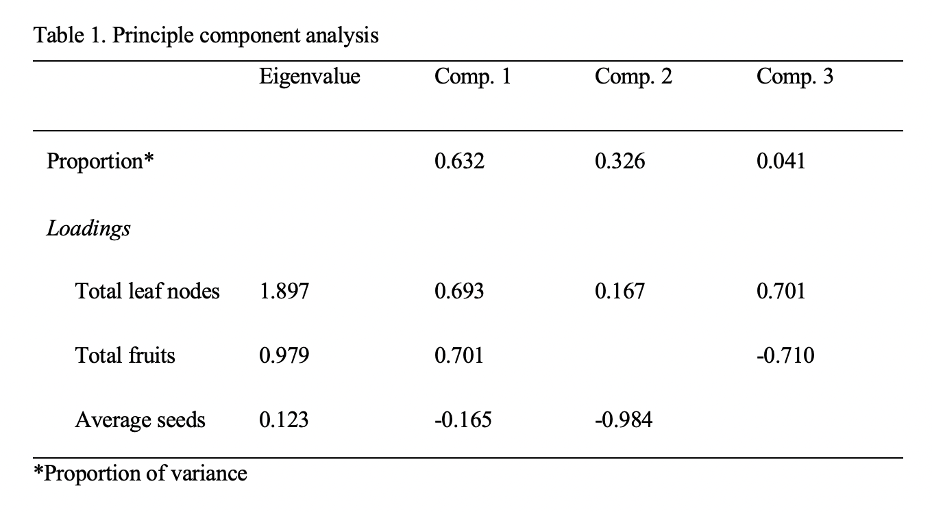

GitHub Link: <https://github.com/zazauwu/432_Group5>

# Load Package

```{r}
library(ape)
library(tidyr)
library(MASS)
library(MuMIn)
library(ggplot2)
library(reshape2)
library(grid)
library(gridExtra)
library(ggfortify)
library(vegan)
library(ggtree)
library(dplyr)
library(cowplot)
```

# Import Data

```{r}
###Climate by site data
clim <- read.csv("./Data/HargreavesEcolLett data hobo&ibutton summary by site.csv")

###NK & HB lifetime reproductive success data
ltrsHB <- read.csv("./Data/HargreavesEcolLett data ltrsHB.csv")
ltrsNK <- read.csv("./Data/HargreavesEcolLett data ltrsNK.csv")

###NK & HB Performance data per subplot
proHB <- read.csv("./Data/HargreavesEcolLett data prop&LTFHB.csv")
proNK <- read.csv("./Data/HargreavesEcolLett data prop&LTFNK.csv")
```

# Climate Effect Analysis

## Data Check and Modification

```{r}
sapply(clim, class)
```

### Description of the variables: 

**d.snowpack.10.11** = days with snowpack winter 2010-2011 

**wTmin.10.11** = minimum temperature winter (C) at plant height 2010-2011 

**Dec.FebTav.10.11** = mean temperature at plant height from Dec1st 2010 - Feb 28th 2011 

**d.grows.11** = \# days in growing season 2011 (start / end of gorwing season determined by sustained snow or frost)

**GDD.grows.11** = \# growing degree days (Tbase=10C, Tmax capped at 30C) in growing season of 2011 

**GDD.yr.11** = \# growing degree days in 2011 (ie not truncated to estimated growing season) 

**avmaxminTJuly.11** = mean July 2011 temperature (C) calculated from daily min and max T: 
mean(July1stmin + July1stmax + July2ndmin + July2ndmax + ... July31stmi + July31stmax) 

**avTJuly.11** = mean July 2011 temperature (C) calculated from raw data (ie \>2 measurements per day)

```{r}
#hence, convert the above columns into numeric variables
cols.num <- c("d.snowpack.11.12", "wTmin.11.12", "Dec.FebTav.11.12", "d.grows.12", "GDD.grows.12", "GDD.yr.12", "avmaxminTJuly.12", "avTJuly.12", "GDD.grows.13", "GDD.yr.13", "avmaxminTJuly.13", "avTJuly.13", "d.snowpack.13.14", "wTmin.13.14", "Dec.FebTav.13.14")
clim[cols.num] <- sapply(clim[cols.num],as.numeric)
sapply(clim, class)
head(clim)
```

```{r}
#combine 'transect' and 'site' info as a unique ID for each row
clim$ID <- as.factor(paste(clim$transect, clim$site, sep='.'))
row.names(clim) <- clim$ID

#remove 'transect' and 'site'
drops <- c("transect","site")
clim <- clim[ , !(names(clim) %in% drops)]

#move 'ID' to the first column
clim <- clim %>%
  relocate(ID)

#use 'melt' to convert the 'clim' data.frame into long format in which 'ID' is identifier variable, while the other are considered as the measured variables.
clim.me <- melt(clim, id.vars = "ID", measure.vars = 2:28)
head(clim.me)
```

```{r}
#use regular expression 'grepl' and 'gsub' to add 'year' column and remove date label in the 'variable' column
clim.me$year <- ifelse(grepl('10.11', clim.me$variable), 
                    'winter 10-11',
                    ifelse(grepl('11.12', clim.me$variable), 
                           'winter 11-12',
                           ifelse(grepl('12.13', clim.me$variable), 
                                  'winter 12-13',
                                  ifelse(grepl('13.14', clim.me$variable), 
                                         'winter 13-14',
                                         ifelse(grepl('grows.11|July.11|yr.11', clim.me$variable), 
                                                'year 2011',
                                                ifelse(grepl('grows.12|July.12|yr.12', clim.me$variable), 
                                                       'year 2012',
                                                       ifelse(grepl('grows.13|July.13|yr.13', clim.me$variable), 
                                                              'year 2013',
                                                              NA)))))))

clim.me <- clim.me %>%
  mutate(variable = gsub(".(\\d).*", "\\2", variable))

head(clim.me)
```

```{r}
#use 'dcast' to cast the molten data.frame into a data frame
clim.ca <- dcast(clim.me, ID + year ~ variable)
clim.ca$year <- as.factor(clim.ca$year)
head(clim.ca)
```

```{r}
#select all rows that contains winter season info and columns related to winter
clim.win <- subset(clim.ca, subset = year %in% c("winter 10-11", "winter 11-12", "winter 12-13", "winter 13-14"),
                   select=c(ID, year, d.snowpack, Dec.FebTav, wTmin))
head(clim.win)
```

```{r}
ggplot(clim.win, aes(x = year, y = d.snowpack, color = ID)) +
  geom_point(size = 0.8, alpha = 0.8) +
  geom_line(aes(group = ID), color = "grey", size = 0.3, alpha = 0.5) +
  xlab("Winter 2010 - 2014") +
  ylab("Days with Snowpack") +
  theme_classic()
```
Comparison of the total days with snowpack in winter among sites sampled from elevational transect NK and HB. Grey solid lines indicate the change in days across years.

```{r}
#select all rows that contains season info except for winter and columns related
clim.not.win <- subset(clim.ca, subset = year %in% c("year 2011", "year 2012", "year 2013"),
                   select=-c(d.snowpack, Dec.FebTav, wTmin))
head(clim.not.win)
```

```{r}
ggplot(clim.not.win, aes(x = year, y = avmaxminTJuly, color = ID)) +
  geom_point(size = 0.8, alpha = 0.8) +
  geom_line(aes(group = ID), color = "grey", size = 0.3, alpha = 0.5) +
  xlab("Year 2011 - 2013") +
  ylab("Mean July temperature (ºC)") +
  theme_classic()
```
Comparison of the mean July temperature (°C) among sites sampled from elevational transect NK and HB. Grey solid lines indicate the change across years from 2011 to 2013.

## Visualize Climate Similarity/Disimilarity

### In winter starting from 2010 to 2014

```{r}
clim.win$tr.si.yr <- paste(clim.win$ID, clim.win$year)
row.names(clim.win) <- clim.win$tr.si.yr
clim.win <- subset(clim.win, select = -c(ID, year) )
head(clim.win)
```

```{r}
climwDist <- dist(clim.win, method = 'euclidean')
climwDistMat <- as.matrix(climwDist)
# rearrange the data from an n×n matrix to a n2×3 matrix
climwPDat <- melt(climwDistMat)

# plot the matrix
ggplot(data = climwPDat, aes(x = Var1, y = Var2, fill = value)) +
  geom_tile() +
  scale_fill_gradientn(colours = c("white","blue","green","red")) +
  theme(axis.text.x = element_text(angle = 90, hjust = 1, vjust = 0.5))
```
A tile plot that demonstrates similarity/dissimilarity of climate charateristics in winter across sample locations at elevation transect NK and HB from 2010 to 2014, color gradient from purple to red indicates value from 0 to >200 and grey indicates missing data. According to the distance matrix, climates in winter at high-elevation (~100m below range edge) and high-elevation range edge at HB are mostly distinct from the rest.

### In other seasons except winter from 2011 to 2013

```{r}
clim.not.win$tr.si.yr <- paste(clim.not.win$ID, clim.not.win$year)
row.names(clim.not.win) <- clim.not.win$tr.si.yr
clim.not.win <- subset(clim.not.win, select = -c(ID, year) )
head(clim.not.win)
```

```{r}
climnwDist <- dist(clim.not.win, method = 'euclidean')
climnwDistMat <- as.matrix(climnwDist)
# rearrange the data from an n×n matrix to a n2×3 matrix
climnwPDat <- melt(climnwDistMat)

# plot the matrix
ggplot(data = climnwPDat, aes(x = Var1, y = Var2, fill = value)) +
  geom_tile() +
  scale_fill_gradientn(colours = c("white","blue","green","red")) +
  theme(axis.text.x = element_text(angle = 90, hjust = 1, vjust = 0.5))
```
Figure 4. A tile plot that demonstrates similarity/dissimilarity of climate charateristics in other seasons except winter across sample locations at elevation transect NK and HB from 2011 to 2013, color gradient from purple to red indicates value from 0 to >200 and grey indicates missing data. According to the distance matrix, climates at low- and mid-elevation at HB and above the high-elevation range edge at NK are mostly distinct from each other.

# Lifetime Reproductive Success Similiarity Analysis

### Description of the variables: 

**year** = year plants were active 

**transect** = elevational transect (where NK = Nakiska and HB = Hailstone Butte) 

**site** = site seeds were transplanted into. L = low elevation, M = mid-elevation (range centre), H = high-elevation (\~100 m below range edge), E or HE = high-elevation range edge, A = above range (HB), A1 = 1st site above the range at NK, A2 = second site above the range at NK 

**treat** = treatment in warming experiment. TR = normal transplant (control), OTC = Open topped warming chambers (warmed), dormant = plants found \> 1 year after seeds planted 

**Source** = source population: low-elevation from that transet (L), mid-elevation from that transect (M), high-elevation (within 100 masl of absolute high-elevation range edge) from that transect (H), edge (absolute high-elevation range edge E), high-elevation (2000 m) populations on neighbouring Moose Mountain (MT) and Fortress Mountain (F), and seeds produced by plants transplanted above the range the previous year (A) 

**plant** = plantID within each 5x5 subplot (row.column from 1.1 = topleft plant to 5.5 = bottom right plant) 

**tbo** = top bitten off by mammal. 0 = no, plant intact, 1 = top bitten off the primary stem, 2 = top bitten off some secondary stalks but primary stem intact 

**Ln.tot** = total leaf nodes (each leaf node produces 2 leaves), including primary, secondary and tertiary stems 

**Fr.tot** = total fruits from all stems

**aveseed1** = average number of seeds per fruit from primary stem fruits 

**aveseed2** = average number of seeds per fruit from secondary stem fruits 

**totgoodseed** = total viable seed produced by the plant 

**totbadseed** = total non-viable seed produced by the plant


## Tidy Data

```{r}
# Select variables
ltrsHB_clean <- ltrsHB %>% select(year:treat, Source:totbadseed)
ltrsNK_clean <- ltrsNK %>% select(year:treat, Source:tbo, Ln.tot:totbadseed)

# Merge datasets
ltrsdat <- rbind(ltrsHB_clean, ltrsNK_clean)

# Remove data not from High, Medium, or Low elevation 
elevation <- c("H", "M", "L")
ltrsdat <- ltrsdat %>% 
  filter(Source %in% elevation)

# Examine variable classes
str(ltrsdat)
```

```{r}
# Subset into High, Medium, and Low Source Elevation
ltrsHigh <- ltrsdat %>% 
    filter(Source == "H") %>% 
    group_by(transect, site, plant) %>%
    mutate(dupID = row_number()) %>%
    ungroup() %>% 
    mutate(plantID = paste(transect, site, plant, dupID), sep = "_") %>% 
    select(plantID, tbo:totbadseed)

ltrsMed <- ltrsdat %>% 
    filter(Source == "M") %>% 
    group_by(transect, site, plant) %>%
    mutate(dupID = row_number()) %>%
    ungroup() %>% 
    mutate(plantID = paste(transect, site, plant, dupID), sep = "_") %>% 
    select(plantID, tbo:totbadseed)

ltrsLow <- ltrsdat %>% 
    filter(Source == "L") %>% 
    group_by(transect, site, plant) %>%
    mutate(dupID = row_number()) %>%
    ungroup() %>% 
    mutate(plantID = paste(transect, site, plant, dupID), sep = "_") %>% 
    select(plantID, tbo:totbadseed)

# Replace column numbers with plantID
ltrsH_OTU <- data.frame(ltrsHigh[,-1], row.names = ltrsHigh$plantID)
ltrsM_OTU <- data.frame(ltrsMed[,-1], row.names = ltrsMed$plantID)
ltrsL_OTU <- data.frame(ltrsLow[,-1], row.names = ltrsLow$plantID)


```

## Examine Dissimilarities for High Elevation Sourced Plants

### Create Distance Matrix

```{r}

# Create distance values
ltrsH_Dist <- dist(ltrsH_OTU, method = 'euclidean')

# Reshape as matrix
ltrsH_DM <- as.matrix(ltrsH_Dist)

# Reshape to be plotted
ltrsH_plotdat <- melt(ltrsH_DM)

# Distance matrix plot
HDM_Plot <- ggplot(ltrsH_plotdat, aes(x = Var1, y = Var2, fill = value)) + 
  geom_tile() +
  scale_fill_gradientn(colours = c("white", "blue", "green", "red")) +
  theme(axis.text.x = element_blank(),
        axis.text.y = element_blank())

HDM_Plot

```

### Visualise similarities with Neighbour-Joining tree

```{r}
# NJ method
ltrsH_tree <- nj(ltrsH_Dist)


# Group by Site
SiteListH <- gsub("\\w+\\s+(\\w+)\\s.*","\\1", ltrsH_tree$tip.label)
SiteGroupH <- split(ltrsH_tree$tip.label, SiteListH)
SiteTreeH <- groupOTU(ltrsH_tree, SiteGroupH)

# Create tree
ltrsHNJTree <- ggtree(SiteTreeH, layout = "circular", aes(colour = group)) +
  geom_tiplab(size = 2, aes(angle = 0)) +
  theme(legend.position = "right")

ltrsHNJTree

```

It appears that plants sourced from high elevations do not have clear similarities when transplanted to similar sites.

## Visualise dissimilarities with Bray-Curtis Dissimilarity

```{r}

# Create distance matrix and tree
ltrsH_bray <- vegdist(ltrsH_OTU, method = "bray", binary = F, na.rm = T)
ltrsHTree_bray <- nj(ltrsH_bray)

# Group by Source
SiteGroupHBray <- split(ltrsHTree_bray$tip.label, SiteListH)
SiteTreeHBray <- groupOTU(ltrsHTree_bray, SiteGroupHBray)

# Create tree
ltrsHBrayTree <- ggtree(SiteTreeHBray, layout = "circular", aes(colour = group)) +
  geom_tiplab(size = 2, aes(angle = 0)) +
  theme(legend.position = "right")

ltrsHBrayTree

```

The Bray-Curtis Dissimilarity tree shows more distinct branches, and one that is notably bluer in hue, indicating that at least some high elevation sourced plants share characteristics when transplanted to high elevation or high elevation range edge sites. However, there still appears to be a through mixing of plant characters.

## Examine Dissimilarities for Medium Elevation Sourced Plants

### Create Distance Matrix

```{r}

# Create distance values
ltrsM_Dist <- dist(ltrsM_OTU, method = 'euclidean')

# Reshape as matrix
ltrsM_DM <- as.matrix(ltrsM_Dist)

# Reshape to be plotted
ltrsM_plotdat <- melt(ltrsM_DM)

# Distance matrix plot
MDM_Plot <- ggplot(ltrsM_plotdat, aes(x = Var1, y = Var2, fill = value)) + 
  geom_tile() +
  scale_fill_gradientn(colours = c("white", "blue", "green", "red")) +
  theme(axis.text.x = element_blank(),
        axis.text.y = element_blank())

MDM_Plot

```

## Visualise similarities with Neighbour-Joining tree

```{r}
# NJ method
ltrsM_tree <- nj(ltrsM_Dist)


# Group by Source
SiteListM <- gsub("\\w+\\s+(\\w+)\\s.*","\\1", ltrsM_tree$tip.label)
SiteGroupM <- split(ltrsM_tree$tip.label, SiteListM)
SiteTreeM <- groupOTU(ltrsM_tree, SiteGroupM)

# Create tree
ltrsMNJTree <- ggtree(SiteTreeM, layout = "circular", aes(colour = group)) +
  geom_tiplab(size = 2, aes(angle = 0)) +
  theme(legend.position = "right")

ltrsMNJTree


```

It appears that plants sourced from mid-elevations do not have clear similarities when transplanted to similar sites.

## Visualise dissimilarities with Bray-Curtis Dissimilarity

```{r}

# Create distance matrix and tree
ltrsM_bray <- vegdist(ltrsM_OTU, method = "bray", binary = F, na.rm = T)
ltrsMTree_bray <- nj(ltrsM_bray)

# Group by Source
SiteGroupMBray <- split(ltrsMTree_bray$tip.label, SiteListM)
SiteTreeMBray <- groupOTU(ltrsMTree_bray, SiteGroupMBray)

# Create tree
ltrsMBrayTree <- ggtree(SiteTreeMBray, layout = "circular", aes(colour = group)) +
  geom_tiplab(size = 2, aes(angle = 0)) +
  theme(legend.position = "right")

ltrsMBrayTree

```

There appears to be a thorough mixing of plant characters across sites, indicating that mid-elevation sourced plants transplanted to similar sites do not have similar characters.

## Examine Dissimilarities for Low Elevation Sourced Plants

### Create Distance Matrix

```{r}

# Create distance values
ltrsL_Dist <- dist(ltrsL_OTU, method = 'euclidean')

# Reshape as matrix
ltrsL_DM <- as.matrix(ltrsL_Dist)

# Reshape to be plotted
ltrsL_plotdat <- melt(ltrsL_DM)

# Distance matrix plot
LDM_Plot <- ggplot(ltrsL_plotdat, aes(x = Var1, y = Var2, fill = value)) + 
  geom_tile() +
  scale_fill_gradientn(colours = c("white", "blue", "green", "red")) +
  theme(axis.text.x = element_blank(),
        axis.text.y = element_blank())

LDM_Plot

```

## Visualise similarities with Neighbour-Joining tree

```{r}
# NJ method
ltrsL_tree <- nj(ltrsL_Dist)


# Group by Source
SiteListL <- gsub("\\w+\\s+(\\w+)\\s.*","\\1", ltrsL_tree$tip.label)
SiteGroupL <- split(ltrsL_tree$tip.label, SiteListL)
SiteTreeL <- groupOTU(ltrsL_tree, SiteGroupL)

# Create tree
ltrsLNJTree <- ggtree(SiteTreeL, layout = "circular", aes(colour = group)) +
  geom_tiplab(size = 2, aes(angle = 0)) +
  theme(legend.position = "right")

ltrsLNJTree


```

It appears that plants sourced from low elevations do not have clear similarities when transplanted to similar sites.

## Visualise dissimilarities with Bray-Curtis Dissimilarity

```{r}

# Create distance matrix and tree
ltrsL_bray <- vegdist(ltrsL_OTU, method = "bray", binary = F, na.rm = T)
ltrsLTree_bray <- nj(ltrsL_bray)

# Group by Source
SiteGroupLBray <- split(ltrsLTree_bray$tip.label, SiteListL)
SiteTreeLBray <- groupOTU(ltrsLTree_bray, SiteGroupLBray)

# Create tree
ltrsLBrayTree <- ggtree(SiteTreeLBray, layout = "circular", aes(colour = group)) +
  geom_tiplab(size = 2, aes(angle = 0)) +
  theme(legend.position = "right")

ltrsLBrayTree

```

While this Bray-Curtis Dissimilarity tree does show mixing of site traits across the tree, there are branches that are more distinctly coloured. This indicates that some low elevation sourced plants may maintain similar characteristics when transplanted to similar sites.

## Compare lifetime reproductive success between treatments across sites

### Compare leaf nodes between treatments

```{r}

# Create plot data
ltrsPlotDat <- ltrsdat %>% mutate(propgoodseed = totgoodseed/(totbadseed + totgoodseed)) %>% 
  select(Source, site, treat, Ln.tot, Fr.tot, propgoodseed)

# Reorder sites
ltrsPlotDat$site <- factor(ltrsPlotDat$site , levels = c("L", "M", "H", "HE", "A", "A1", "A2"))

# Filter for mid and high elevations
MidPlotDat <- ltrsPlotDat %>%  filter(Source == "M")
HighPlotDat <- ltrsPlotDat %>%  filter(Source == "H")


# Mid Elevation Source Plot
# Create Mid Elevation plot
MidLeafPlot <- ggplot(MidPlotDat, aes(x = site, y = Ln.tot, fill = treat)) +
  geom_boxplot(width = 0.5) +
  scale_x_discrete(name = "\n Transplant site", 
                   labels = c("Low elevation", "Mid-elevation", "High elevation", 
                              "High elevation range edge", "Above range HB",
                              "First site above range NK", "Second site above range NK")) +
  scale_y_continuous(name = "Total leaf nodes \n")+
  scale_fill_discrete(name = "Treatment", labels = c("Warmed", "Control")) +
  ggtitle("Leaf growth of mid-elevation sourced plants") +
  theme_classic() +
  theme(axis.text.x = element_text(angle = 45, vjust = 1, hjust = 1, size = 5),
        plot.title = element_text(hjust = 0.5))

MidLeafPlot

# High Elevation Source Plot
# Create Mid Elevation plot
HighLeafPlot <- ggplot(HighPlotDat, aes(x = site, y = Ln.tot, fill = treat)) +
  geom_boxplot(width = 0.5) +
  scale_x_discrete(name = "\n Transplant site", 
                   labels = c("Low elevation", "Mid-elevation", "High elevation", 
                              "High elevation range edge", "Above range HB",
                              "First site above range NK", "Second site above range NK")) +
  scale_y_continuous(name = "Total leaf nodes \n")+
  scale_fill_discrete(name = "Treatment", 
                      labels = c("Warmed", "Control")) +
  ggtitle("Leaf growth of high elevation sourced plants") +
  theme_classic() +
  theme(axis.text.x = element_text(angle = 45, vjust = 1, hjust = 1, size = 5),
        plot.title = element_text(hjust = 0.5))

HighLeafPlot


```

The boxplot showing leaf growth data for mid-elevation plants appears to show that some differences do exist for plants transplanted to mid-elevation and high elevation sites. Mid-elevation to mid-elevation plants appear to have decreased leaf growth in warming chambers compared to the control, indicating that the conditions for growth are not within the species optimal. Conversely, mid-elevation plants transplanted to high elevation with warming showed higher levels of leaf growth than the control, likely due to the warming chamber producing a temperature closer to their native range. The boxplot showing leaf growth data for high elevation plants appears to show that there may have been a difference in leaf growth for high elevation sourced plants transplanted to mid-elevation sites. When placed in a warming chamber, these plants appear to have slightly elevated levels of leaf growth compared to the control, however there is a high degree of variability.


### Compare fruits between treatments

```{r}

# Mid Elevation Source Plot
# Create Mid Elevation plot
MidFruitPlot <- ggplot(MidPlotDat, aes(x = site, y = Fr.tot, fill = treat)) +
  geom_boxplot(width = 0.5) +
  scale_x_discrete(name = "\n Transplant site", 
                   labels = c("Low elevation", "Mid-elevation", "High elevation", 
                              "High elevation range edge", "Above range HB",
                              "First site above range NK", "Second site above range NK")) +
  scale_y_continuous(name = "Total fruits from all stems \n")+
  scale_fill_discrete(name = "Treatment", labels = c("Warmed", "Control")) +
  ggtitle("Fruit development of mid-elevation sourced plants") +
  theme_classic() +
  theme(axis.text.x = element_text(angle = 45, vjust = 1, hjust = 1, size = 5),
        plot.title = element_text(hjust = 0.5))

MidFruitPlot

# High Elevation Source Plot
# Create Mid Elevation plot
HighFruitPlot <- ggplot(HighPlotDat, aes(x = site, y = Fr.tot, fill = treat)) +
  geom_boxplot(width = 0.5) +
  scale_x_discrete(name = "\n Transplant site", 
                   labels = c("Low elevation", "Mid-elevation", "High elevation", 
                              "High elevation range edge", "Above range HB",
                              "First site above range NK", "Second site above range NK")) +
  scale_y_continuous(name = "Total fruits from all stems \n")+
  scale_fill_discrete(name = "Treatment", 
                      labels = c("Warmed", "Control")) +
  ggtitle("Fruit development of high elevation sourced plants") +
  theme_classic() +
  theme(axis.text.x = element_text(angle = 45, vjust = 1, hjust = 1, size = 5),
        plot.title = element_text(hjust = 0.5))


HighFruitPlot


```

Similar to the pattern observed in leaf growth of mid-elevation plants transplanted to mid- and high elevation sites, mid-elevation plants transplanted to mid- and high elevation sites show possible differences in fruit development. Possibly as a result of growing in elevated temperatures outside of the plant's native range, plants transplanted to mid-elevation warming chambers appear to have decreased fruit growth compared to controls. Plants transplanted to high elevation appear to have a much higher amount of fruits on average, possibly due to being grown in a more optimal temperature range. The boxplot showing fruit development for high elevation sourced plants appears to not illustrate many differences between sites or between treated groups and controls. The largest difference appears to be in plants transplanted above the range at Hailstone Butte, but this may be the result of a lack of data at that site.


### Compare proportion of good seeds between sites for each source

```{r}

# Mid Elevation Source Plot
# Create Mid Elevation plot
MidSeedPlot <- ggplot(MidPlotDat, aes(x = site, y = propgoodseed, fill = treat)) +
  geom_boxplot(width = 0.5) +
  scale_x_discrete(name = "\n Transplant site", 
                   labels = c("Low elevation", "Mid-elevation", "High elevation", 
                              "High elevation range edge", "Above range HB",
                              "First site above range NK", "Second site above range NK")) +
  scale_y_continuous(labels = scales::percent, 
                     name = "Percentage of viable seeds produced by plant \n")+
  scale_fill_discrete(name = "Treatment", labels = c("Warmed", "Control")) +
  ggtitle("Seed viability of mid-elevation sourced plants") +
  theme_classic() +
  theme(axis.text.x = element_text(angle = 45, vjust = 1, hjust = 1, size = 5),
        plot.title = element_text(hjust = 0.5))

MidSeedPlot

# High Elevation Source Plot
# Create Mid Elevation plot
HighSeedPlot <- ggplot(HighPlotDat, aes(x = site, y = propgoodseed, fill = treat)) +
  geom_boxplot(width = 0.5) +
  scale_x_discrete(name = "\n Transplant site", 
                   labels = c("Low elevation", "Mid-elevation", "High elevation", 
                              "High elevation range edge", "Above range HB",
                              "First site above range NK", "Second site above range NK")) +
  scale_y_continuous(labels = scales::percent,
                     name = "Percentage of viable seeds produced by plant \n")+
  scale_fill_discrete(name = "Treatment", 
                      labels = c("Warmed", "Control")) +
  ggtitle("Seed viability of high elevation sourced plants") +
  theme_classic() +
  theme(axis.text.x = element_text(angle = 45, vjust = 1, hjust = 1, size = 5),
        plot.title = element_text(hjust = 0.5))

HighSeedPlot

```

In both mid-elevation and high elevation sourced plants, there appears to be little differences in treatments in proportion viable seeds produced. There is, however, large amounts of variation for low to high elevation range edge sites, and a notable decrease in amount of data available for above range sites at both Nakiska and Hailstone Butte.


## PCA

Using 'totgoodseed' to measure the indirect fitness of the sampling plant communities.

```{r}
head(ltrsdat)
```

```{r}
ltrs_pc <- subset(ltrsdat, subset = site %in% c("L", "M", "H"),
                   select=-c(aveseed2, totbadseed))
head(ltrs_pc)
```

### performs a principal components analysis on the numeric data matrix

The following chunks are used to make table 1 attached in the poster.

```{r}
# delet NA values
ltrs_pc <- ltrs_pc %>%
  na.omit()

ltrsfull <- princomp(ltrs_pc[,8:10], cor = T)
summary(ltrsfull)
```

```{r}
loadings(ltrsfull)
```

```{r}
head(ltrsfull$scores)
```

```{r}
 round(cor(ltrsfull$scores),3)
```

```{r}
library(factoextra)

eig.val1 <- get_eigenvalue(ltrsfull)
eig.val1
```

PC axes are uncorrelated with each other: that the diagonal is 1 represents the correlation of each PC axis with itself, while the off-diagonals are zero, meaning that the correlation coefficient is \<0.001. Besides, for the dimensions, an eigenvalue \> 1 indicates that the principal component (PCs) accounts for more variance than accounted by one of the original variables in standardized data.

```{r}
ltrs_pc$PC1 <- ltrsfull$scores[,1]
ltrs_pc$PC2 <- ltrsfull$scores[,2]
ltrs_pc$PC3 <- ltrsfull$scores[,3]
```

```{r}
PCltrsMod1 <- lm(PC1 ~ site*treat, data = ltrs_pc)
summary(PCltrsMod1)
anova(PCltrsMod1)
```
p-value <0.05 suggests there is no significant evidence in favor of a potential relationship between component 1 and factors including treatment type and elevation sites except median-elevation. Specifically, the linear regression line is steepest for the plants normally transplanted(TR) to median elevation.

```{r}
PCltrsMod2 <- lm(PC2 ~ site*treat, data = ltrs_pc)
summary(PCltrsMod2)
anova(PCltrsMod2)
```
p-value <0.05 suggests there is significant evidence in favor of a potential relationship between component 2 and factors including elevation and treatment.

```{r}
PCltrsMod3 <- lm(PC3 ~ site*treat, data = ltrs_pc)
summary(PCltrsMod3)
anova(PCltrsMod3)
```
p-value >0.05 suggests there is no significant evidence in favor of a potential relationship between component 3 and factors including elevation and treatment.

### Table 1
```{r, echo=FALSE, out.width="50%", fig.align = 'center'}

```
Given by the table, in the principal component analysis, the most prominent biological factor (eigenvalue: 1.897, total variance explained: 63.2%) was total leaf nodes, including primary, secondary and tertiary stems.

## Ploting PCA

```{r}
qplot(x = PC1, y = PC2, color = site, facets = "Source", data = ltrs_pc) +
theme_classic()
```

```{r}
fviz_pca_ind(ltrsfull,
             col.ind = ltrs_pc$Source, # color by groups
             palette = c("#00AFBB",  "#FC4E07", "#9FA0C5"),
             addEllipses = TRUE, # Concentration ellipses
             ellipse.type = "confidence",
             legend.title = "Sources",
             repel = TRUE
             )
```

```{r}
autoplot(ltrsfull, data = ltrs_pc, size = 0.6, loadings = T, loadings.label = T) + theme_classic()
```

Compare the direction of these projected eigenvectors to the loadings in the output, it shows that component 1 is affected by total leaf nodes and total fruits from all stems, while component 2 is more affected by average seeds produced by the primary fruit.

## Plotting Factor Analysis

```{r}
ltrsdat$year <- as.factor(ltrsdat$year)
ltrsdat$transect <- as.factor(ltrsdat$transect)
ltrsdat$site <- as.factor(ltrsdat$site)
ltrsdat$treat <- as.factor(ltrsdat$treat)
ltrsdat$Source <- as.factor(ltrsdat$Source)
ltrsdat$tbo <- as.factor(ltrsdat$tbo)
```

### Calculate Principal Components

```{r}
library(FactoMineR)

## FAMD
ltrs_fa <- subset(ltrsdat, subset = site %in% c("L", "M", "H"),
                   select=-c(aveseed2, totbadseed))

ltrs_fa <- ltrs_fa %>%
  na.omit()

ltrs.famd <- FAMD(ltrs_fa, 
                 sup.var = 4,  ## Set the target variable "treatment" as a supplementary variable
                 graph = FALSE, 
                 ncp=25)

## Inspect principal components
get_eigenvalue(ltrs.famd)
```

```{r}
## Plot individual observations
fviz_famd_ind(ltrs.famd, label = "none", 
              habillage = "treat", palette = c("#FC4E07",  "#63d5ff"), # color by groups 
              repel = TRUE, alpha.ind = 0.5) + 
  xlim(-5, 6) + ylim (-4.5, 4.5) +
  theme(text = element_text(size = 15), axis.text.x = element_text(size = 15), axis.text.y = element_text(size = 15))
```

As individuals with similar characteristics (in this case, in terms of plants' before- and after- habitat and reproductive success) are close to each other on the figure, the large overlap between the "OTC" and "TR" populations suggests that if there are significant/meaningful differences between control and warmed groups, they are likely complex and non-linear.

***

# Seed emergence vs. Range Analysis

Question: do plants transplanted to warmer ranged seed earlier than plants in cooler ranges, and does this change between NK and HB?

## Potential relationship between seed emergence(nEmzt) and range of plant habitats.
```{r}
#plot for HB created
proHB_1 <- ggplot(proHB, 
                  aes(x = Source, 
                      fill = nEmzt)) + 
  geom_bar(position = position_dodge(width=0.8)) +
  geom_text(aes(label=..count..), stat= "count", position=position_dodge(width=0.9), vjust=-0.25) +
  ylab("Seed emergence (# of nEmzt)")

#plot for NK created
proNK_1 <- ggplot(proNK, 
                  aes(x = Source, 
                      fill = nEmzt)) + 
  geom_bar(position = position_dodge(width=0.8))+
  geom_text(aes(label=..count..), stat= "count", position=position_dodge(width=0.9), vjust=-0.25)+
  ylab("")+
  theme(axis.text.y=element_blank(),
        axis.ticks.y=element_blank())
```

```{r}
#the above two plots are arranged side-to-side for the purpose of comparison
plot_grid(proHB_1, proNK_1, labels = c('HB','NK'), ncol=2) + theme_cowplot()
```

As seen in the plot, there is an obvious increase in the number of plant emergence at source E, which stands for the absolute high-elevation range edge, in NK comparing to HB. Increase in plant emergence are also seen in F (Fortress Mountain), L (low-elevation from that transet), and MT (neighbouring Moose Mountain above 2000m).

***
## Group by transplant location
In this section, groups are categorized by transplant location (“treat”, control or warming chambers) using similar codes above.
```{r}
proHB_2 <- ggplot(proHB, aes(treat))+
  geom_bar()+
  scale_y_continuous(limits=c(0, 600))+
  geom_text(aes(label=..count..), stat= "count", position=position_dodge(width=0.9), vjust=-0.25)

proNK_2 <- ggplot(proNK, aes(treat))+
  geom_bar()+
  ylab("")+
  geom_text(aes(label=..count..), stat= "count", position=position_dodge(width=0.9), vjust=-0.25)+
  theme(axis.text.y=element_blank(),
        axis.ticks.y=element_blank())

plot_grid(proHB_2, proNK_2, labels = c('HB','NK'), ncol=2) + theme_cowplot()
```
According to plots generated above indicates that the controlled normal plant population (TR) has greater number comparing to the ones within the Open topped warming chambers (OTC). When comparing the count number between HB and NK, both treats increase by approximately 40. Therefore, it is predicted that plants from higher elevations transplanted to warmer ranges will seed earlier. Plants from lower elevations transplanted to cooler ranges will seed later.
